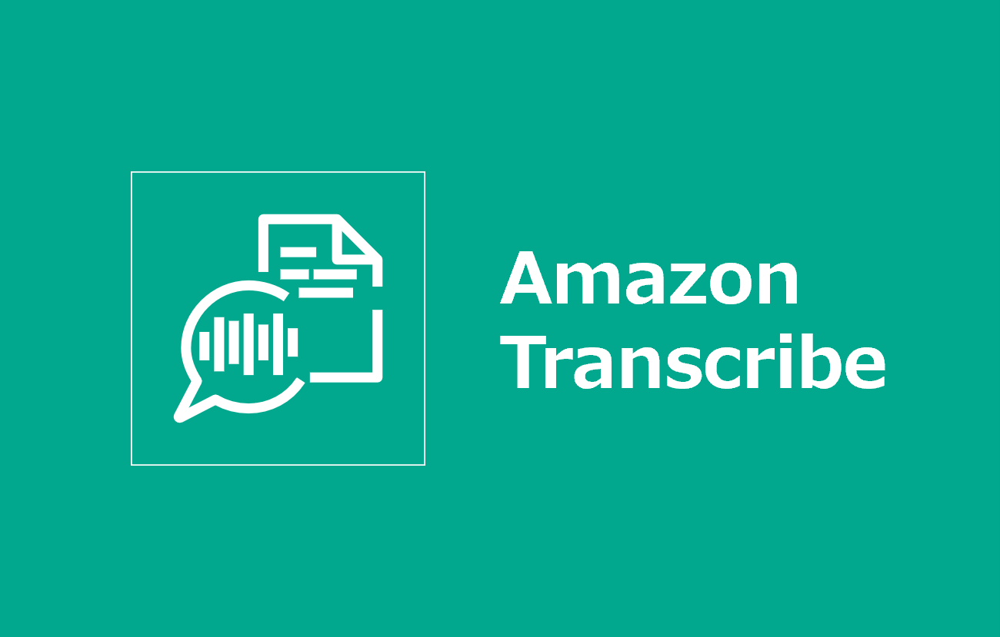
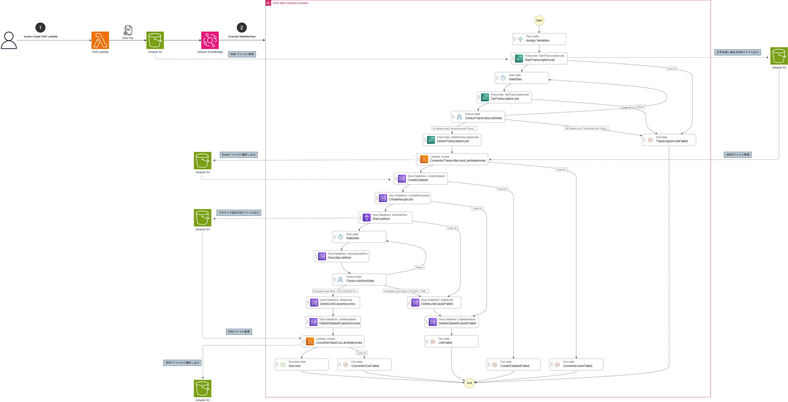

=====================================================================
Amazon Transcribe × AWS Glue で日本語音声ファイルの文字起こしとマスキングを実装してみた
=====================================================================
* `詳細 <>`_

=====================================================================
構成図
=====================================================================

=====================================================================
デプロイ - Terraform -
=====================================================================

作業環境 - ローカル -
=====================================================================
* macOS Tahoe ( v26.4.1 )
* Visual Studio Code 1.116.0
* Terraform v1.15.1
* aws-cli/2.34.45 Python/3.14.4 Darwin/25.4.0 exe/arm64

フォルダ構成
=====================================================================
* `こちら <./folder.md>`_ を参照

前提条件
=====================================================================
* *AdministratorAccess* がアタッチされているIAMユーザーを作成していること
* 実作業は *envs* フォルダで実施すること
* 以下コマンドを実行し、*admin* プロファイルを作成していること (デフォルトリージョンは *ap-northeast-1* )

.. code-block:: bash
  
  aws login --profile admin

.. code-block:: bash

  CONFIG="$HOME/.aws/config"
  
  PROFILES=(
    admin
  )
  
  for PROFILE in "${PROFILES[@]}"; do
    LINE="credential_process = aws configure export-credentials --profile ${PROFILE}"
  
    awk -v profile="$PROFILE" -v line="$LINE" '
    BEGIN {
      in_profile = 0
      found = 0
    }
  
    /^\[profile[[:space:]]+/ {
      # 対象 profile を抜ける直前に、未追加なら挿入
      if (in_profile && !found) {
        print line
      }
      in_profile = ($0 == "[profile " profile "]")
      found = 0
    }
  
    {
      if (in_profile && $0 ~ /^[[:space:]]*credential_process[[:space:]]*=/) {
        found = 1
      }
      print
    }
  
    END {
      # ファイル末尾が対象 profile の場合
      if (in_profile && !found) {
        print line
      }
    }
    ' "$CONFIG" > "$CONFIG.tmp" && command mv -f "$CONFIG.tmp" "$CONFIG"
  
  done

事前作業(1)
=====================================================================
1. 各種モジュールインストール
---------------------------------------------------------------------
* `GitHub <https://github.com/tyskJ/common-environment-setup>`_ を参照

事前作業(2)
=====================================================================
1. *tfstate* 用S3バケット作成
---------------------------------------------------------------------

.. note::

  * バケット名は全世界で一意である必要があるため、作成に失敗した場合は任意の名前に変更

.. code-block:: bash

  PROFILE="admin"
  ACCOUNT_ID=$(aws sts get-caller-identity --query Account --output text --profile ${PROFILE})
  REGION="ap-northeast-1"
  BUCKET_PREFIX="tfstate"
  BUCKET_NAME="${BUCKET_PREFIX}-${ACCOUNT_ID}-${REGION}-an"

.. code-block:: bash
  
  aws s3api create-bucket \
  --bucket "${BUCKET_NAME}" \
  --bucket-namespace account-regional \
  --region "${REGION}" \
  --create-bucket-configuration LocationConstraint="${REGION}" \
  --profile "${PROFILE}"

実作業 - ローカル -
=====================================================================
1. *backend* 用設定ファイル作成
---------------------------------------------------------------------

.. note::

  * *envs* フォルダ配下に作成すること

.. code-block:: bash

  SYSTEM="aws-transcribe-pii-reduction-by-glue"

.. code-block:: bash
    
  cat <<EOF > config.aws.tfbackend
  bucket = "${BUCKET_NAME}"
  key = "${SYSTEM}/terraform.tfstate"
  region = "${REGION}"
  profile = "${PROFILE}"
  EOF

2. *Terraform* 初期化
---------------------------------------------------------------------
.. code-block:: bash
  
  terraform init -backend-config="./config.aws.tfbackend"

3. 事前確認
---------------------------------------------------------------------
.. code-block:: bash

  terraform plan

4. デプロイ
---------------------------------------------------------------------
.. code-block:: bash

  terraform apply --auto-approve

後片付け - ローカル -
=====================================================================
1. 環境削除
---------------------------------------------------------------------
.. code-block:: bash

  terraform destroy --auto-approve

2. *tfstate* 用S3バケット削除
---------------------------------------------------------------------
.. code-block:: bash

  aws s3 rm s3://${BUCKET_NAME} --recursive --profile ${PROFILE}
  aws s3 rb s3://${BUCKET_NAME} --profile ${PROFILE}

参考資料
=====================================================================
リファレンス
---------------------------------------------------------------------
* `terraform_data resource reference <https://developer.hashicorp.com/terraform/language/resources/terraform-data>`_
* `Backend block configuration overview <https://developer.hashicorp.com/terraform/language/backend#partial-configuration>`_
* `Retain API GW Deployment History for Stage #42625 <https://github.com/hashicorp/terraform-provider-aws/issues/42625>`_

ブログ
---------------------------------------------------------------------
* `Terraformでmoduleを使わずに複数環境を構築する - Zenn <https://zenn.dev/smartround_dev/articles/5e20fa7223f0fd>`_
* `Terraformでmoduleを使わずに複数環境を構築して感じた利点 - SpeakerDeck <https://speakerdeck.com/shonansurvivors/building-multiple-environments-without-using-modules-in-terraform>`_
* `個人的備忘録：Terraformディレクトリ整理の個人メモ（ファイル分割編） - Qiita <https://qiita.com/free-honda/items/5484328d5b52326ed87e>`_
* `Terraformの auto.tfvars を使うと、環境管理がずっと楽になる話 - note <https://note.com/minato_kame/n/neb271c81e0e2>`_
* `Terraform v1.9 では null_resource を安全に terraform_data に置き換えることができる - Zenn <https://zenn.dev/terraform_jp/articles/tf-null-resource-to-terraform-data>`_
* `【Terraform🧑🏻‍🚀】tfstateファイルの分割パターンとディレクトリ構成への適用 <https://hiroki-hasegawa.hatenablog.jp/entry/2023/07/05/001756>`_
* `Terraformで自己署名証明書の作成からALBの適用までを一発で実施する - DevelopersIO <https://dev.classmethod.jp/articles/terraform-self-signed-certificate-alb-setup/>`_
* `aws login コマンドの認証情報で Terraform を実行する - Zenn <https://zenn.dev/yukit7s/articles/4a81811d64a200>`_
* `OpenAPI Specification 3.0.3規約 <https://future-architect.github.io/coding-standards/documents/forOpenAPISpecification/OpenAPI_Specification_3.0.3.html>`_
* `Terraform AWS Provider version 6がリリースされ、複数リージョンへの展開がかなり簡単になりました - DevelopersIO <https://dev.classmethod.jp/articles/terraform-aws-provider-version-6/>`_
* `【Terraform】AWS Provider v6 からはリソースレベルでリージョンを設定できる - Zenn <https://zenn.dev/terraform_jp/articles/tf-aws-v6-per-resource-region>`_